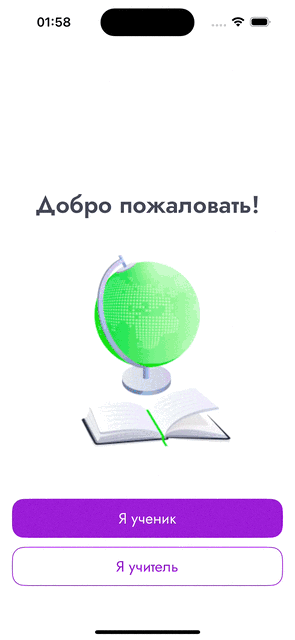
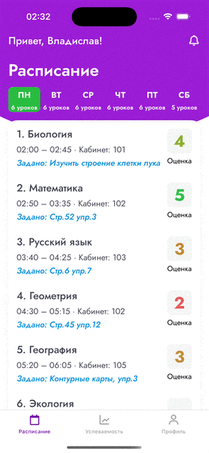
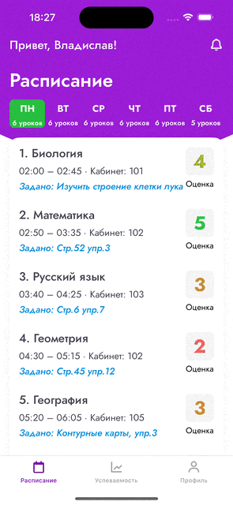
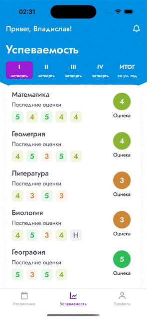

# NeoSchool iOS App  

## My First UIKit Project (Using Only SnapKit for Layouts)  

NeoSchool is a school simulation app designed for two types of users: teachers and students. This project includes the following features:  
- Uploading and sending images from the camera or photo library  
- Email-based authentication with options for password recovery and updates  
- Notifications (excluding push notifications)  

## User Features  

Users can log in as either a teacher or a student. If a password is forgotten, they can reset it via the **"Forgot Password"** option by entering their email address. Additionally, users can update their passwords through the **Settings** tab. Notifications can be viewed by tapping the bell icon.  

  

## Teacher Features  

Teachers have access to tools for:  
- Viewing schedules, assigning homework, and grading it  
- Setting classwork and quarter grades  

  

## Student Features  

Students can:  
- View their schedules and grades (homework, classwork, and quarter)  
- Receive homework assignments and submit their work  

  

## Minimum Requirements  
- iOS 16.6  
- Swift 5.7
